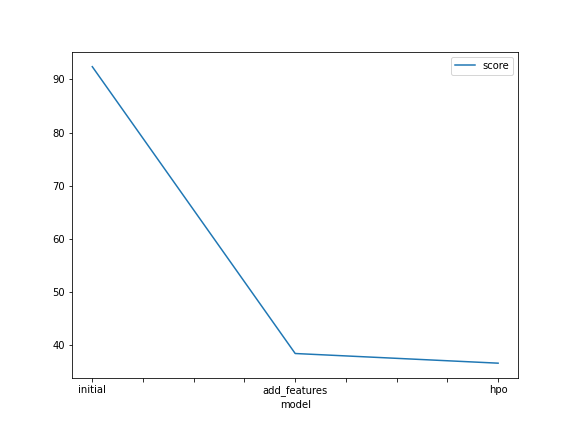
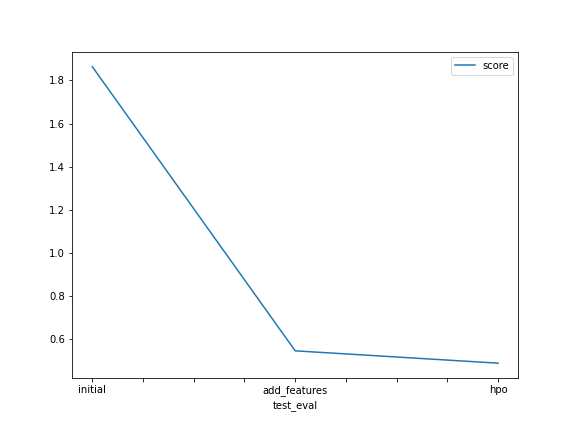

# Report: Predict Bike Sharing Demand with AutoGluon Solution
#### Ghita Hatimi

## Initial Training
### What did you realize when you tried to submit your predictions? What changes were needed to the output of the predictor to submit your results?
TODO: I realized that I needed to remove negative values from the output.

### What was the top ranked model that performed?
TODO: the top ranked model was the model to which we finetuned the hyperparameters, by tweaking some parameters in my case 
fixing kwargs to auto the models trained by AutoGluon had better performance.

## Exploratory data analysis and feature creation
### What did the exploratory analysis find and how did you add additional features?
TODO: through exploratory analysis I found that some features had wrong types, so the model wasn't using the data in the correct way. The additional features were fields of the datetime feature. 

### How much better did your model preform after adding additional features and why do you think that is?
TODO: The model performed 70% better when I added the additional featues and that is because the new features added new information which helped the model build a better pattern of the data.

## Hyper parameter tuning
### How much better did your model preform after trying different hyper parameters?
TODO: The model performed 22% better.

### If you were given more time with this dataset, where do you think you would spend more time?
TODO: i would spend more time doing exploratory data analysis to comprend the data more, and perform better transformation.

### Create a table with the models you ran, the hyperparameters modified, and the kaggle score.
|model|time_limit|presets|hyperparameter_tune_kwargs|score|
|--|--|--|--|--|
|initial|600|best_quality|default|1.86|
|add_features|600|best_quality|default|0.54|
|hpo|717|best_quality|auto|0.48|

### Create a line plot showing the top model score for the three (or more) training runs during the project.

TODO: Replace the image below with your own.

### Create a line plot showing the top kaggle score for the three (or more) prediction submissions during the project.

TODO: Replace the image below with your own.

## Summary
TODO: In summary, using AutoGluon for model training is a really optimal method to train models efficiently. In addition, 
the cleaner the data and the better its representation the better the overall performance of the model, also tweaking models hyperparameters can optimize the performance.
